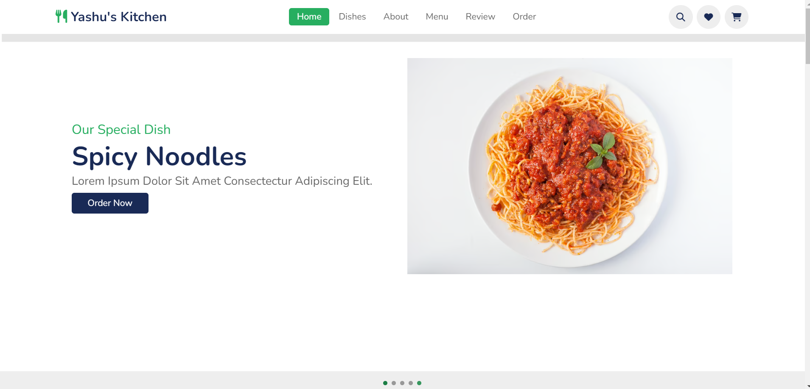
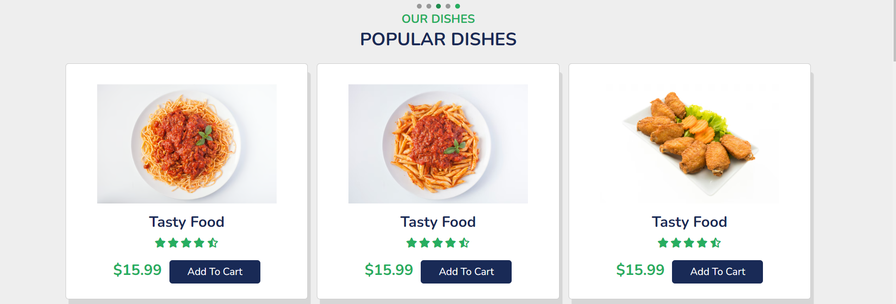
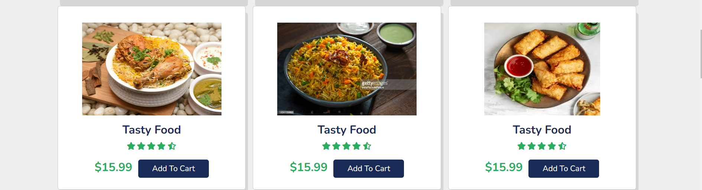
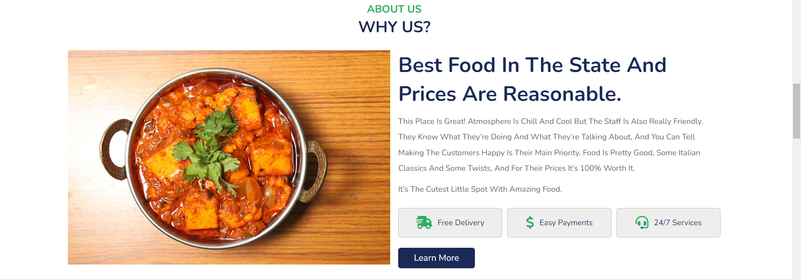
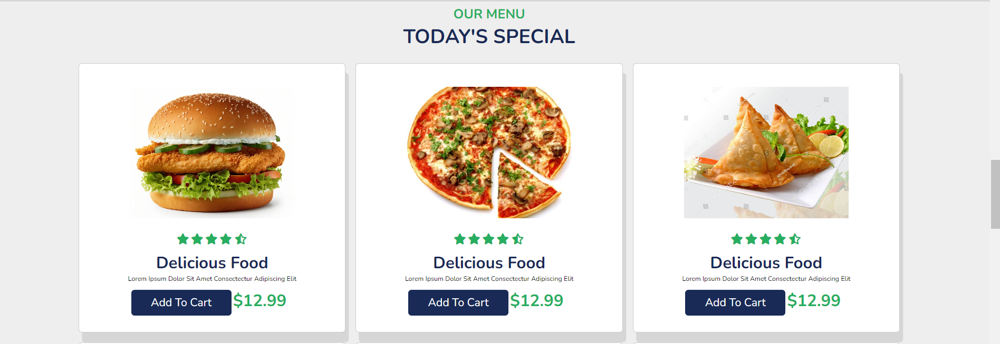
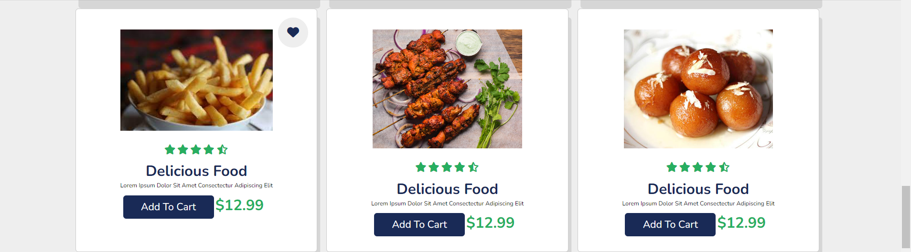
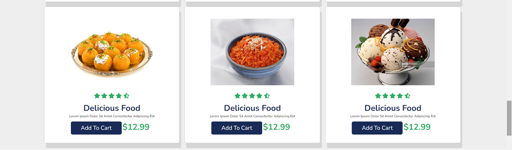
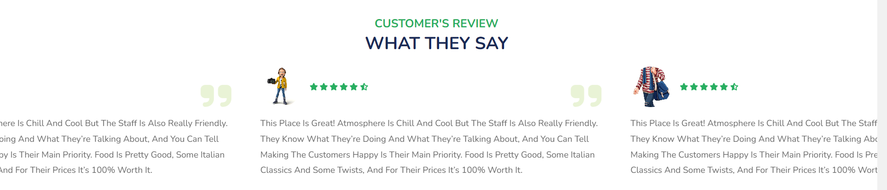
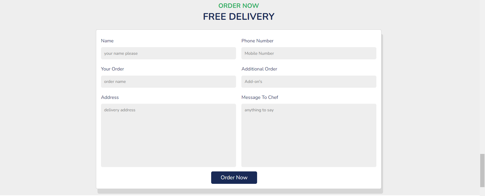
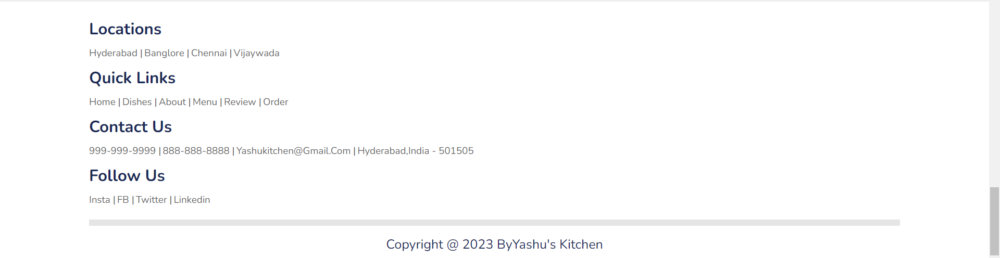

# Restaurant-website 
Deployment-link:-https://yasaswini25.github.io/Personal-website/
### Project:-
Created a responsive online portal for Restaurant with main features that include:-
✔ responsive header / navbar with toggle menu bar effect and search bar icon along with add to cart icon.
✔ responsive home section with touch slider using swiper.js
✔ responsive dishes card section using grid.
✔ responsive about section using flexbox.
✔ responsive menu card section using grid.
✔ responsive review section with automatic slider using swiper.js
✔ responsive order form section.
### Technologies used

### Landing page

